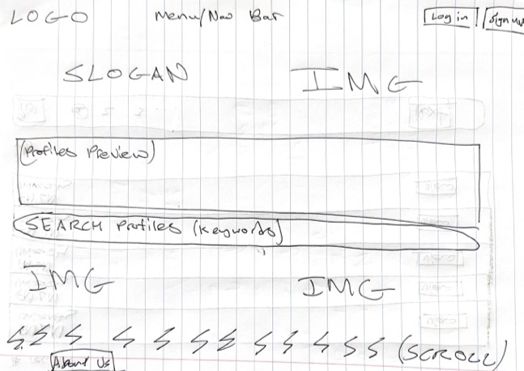

# Data Interactions

- High Schools
- Colleges
Students will say what high school and college they're a part of so the website can match them. 

- Q&A Posts
Can ask specific open questions about college or college applications. 

- Likes
Can like posts to increase their visibility and ranking.

- Comments
Can comment to respond to Q&A and other posts. 

- Media (images and documents)
Can share images and documents like syllabi, campus photos, etc.

- Courses
Can list popular courses

# Wireframes
Homepage:

Search results:

